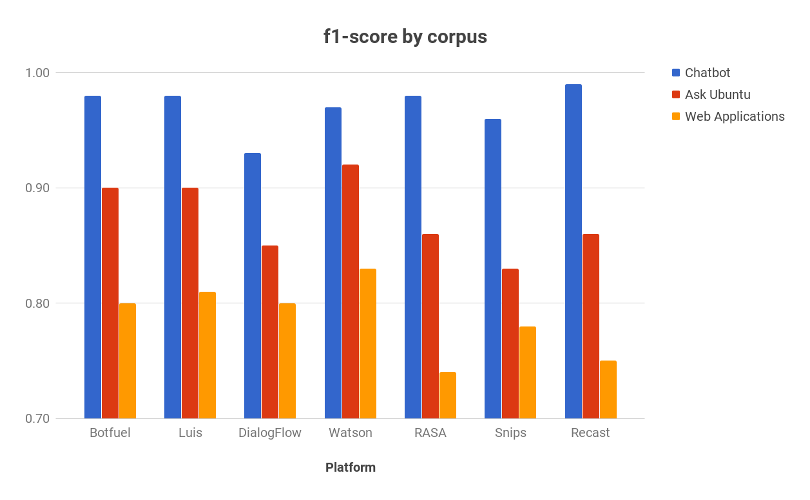

# Benchmark report

## Setup

3 corpus called `Chatbot`, `Ask Ubuntu` and `Web Applications` as described in the paper http://workshop.colips.org/wochat/@sigdial2017/documents/SIGDIAL22.pdf

| corpus           | num of intents | train | test |
| ---------------- | -------------- | ----- | ---- |
| Chatbot          | 2              | 100   | 106  |
| Ask Ubuntu       | 5              | 53    | 109  |
| Web Applications | 8              | 30    | 59   |

For `Ask Ubuntu` and `Web Application` corpus, there is a specific `None` intent for sentences that should not be matched with the other intents.

## Intent classification results

While the paper did the benchmark for both intent classification and entity extraction, we will focus only on intent classification. We compute the `f1` score for each corpus and the overall `f1`:

| Platform\Corpus  | Chatbot | Ask Ubuntu | Web Applications | Overall |
| ---------------- | ------- | ---------- | ---------------- | ------- |
| Botfuel          | 0.98    | 0.90       | 0.80             | 0.91    |
| Luis             | 0.98    | 0.90       | 0.81             | 0.91    |
| API (DialogFlow) | 0.93    | 0.85       | 0.80             | 0.87    |
| Watson           | 0.97    | 0.92       | 0.83             | 0.92    |
| RASA             | 0.98    | 0.86       | 0.74             | 0.88    |
| Snips            | 0.96    | 0.83       | 0.78             | 0.89    |
| Recast           | 0.99    | 0.86       | 0.75             | 0.89    |

* Result for Botfuel is done using the `Botfuel Trainer`
* Result for Luis, API (now DialogFlow), Watson and RASA are extracted from paper (only the intent classification part)
* Result for Snip is computed from their result on the github page (https://github.com/snipsco/nlu-benchmark/tree/master/2018-01-Braum-et-al-extension). They have results for both intent classification and entity extraction and we extracted the intent classification part.
* Result for Recast is done by us using Recast API and UI (for manual verification if intents and entities are the same as in the training set).
